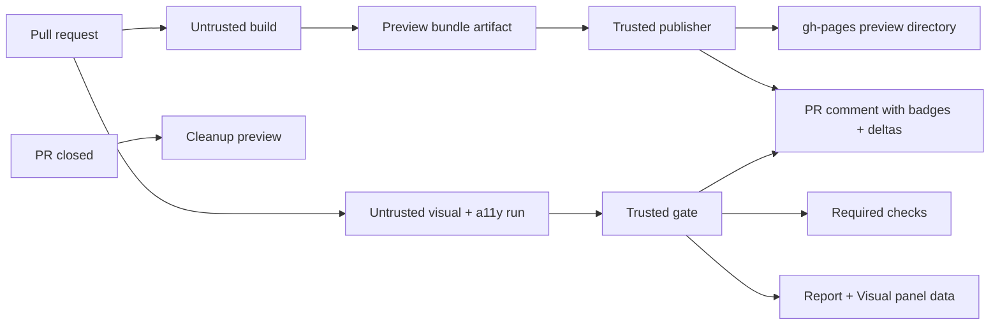

# storybook-github-swiss-knife

[](https://github.com/Archetipo95/storybook-github-swiss-knife/actions/workflows/ci.yml)
[](https://opensource.org/licenses/MIT)

Storybook on GitHub, in one place: Pages deploys, PR previews, and visual regression plus accessibility checks on every pull request. Storybook 8.6, 9 and 10, any framework, npm/pnpm/yarn/bun.

The successor of [storybook-github-pages](https://github.com/Archetipo95/storybook-github-pages): every one of its inputs still works, see [Migration](docs/migration.md).

## Why use it?

- **Visual regression for every story**: screenshots compared with the base branch, interaction (play) tests in the same pass, changes accepted with a label. A trusted gate posts the required `swiss-knife / visual` check.
- **Accessibility**: axe on every story, with a baseline of known violations, so only new ones block (`swiss-knife / accessibility`).
- **Results where reviewers look**: one PR comment with the preview link and both results, a published report, and a Storybook addon with a Visual panel (base/PR screenshots, changed pixels) and sidebar statuses.
- **PR previews and Pages deploys**: an untrusted build, a trusted publisher, stale-run protection, cleanup and a janitor.
- **Secure by default**: pull request code runs read-only and without secrets; trusted steps never check it out; every action is SHA-pinned. See [Security](SECURITY.md).
- **Project health**: SVG badges, component coverage and a growth chart.

## Quickstart

From the repository root:

```bash
npx storybook-swiss-knife init
```

It writes the caller workflows, `.storybook/swiss-knife.json` and the addon registration, creates the `visual-approved` label, and lists what is left: install the addon, make the two checks required, push once to the base branch for baselines. The manual setup is in [Visual regression and accessibility](docs/visual-regression.md).

Only Pages deploys:

```yaml
name: Deploy Storybook

on:
  push:
    branches: [main]

permissions:
  contents: read
  pages: write
  id-token: write

jobs:
  deploy-storybook:
    uses: Archetipo95/storybook-github-swiss-knife/.github/workflows/deploy-storybook.yml@v0.1.1
    with:
      path: 'storybook-static'
      package_manager: 'npm'
      build_command: 'npm run build-storybook'
```

Need a custom pipeline or branch-backed directory deploy? See [Usage](docs/usage.md).

> The Storybook addon isn't on npm yet: install the tarball attached to each release, `npm install --save-dev https://github.com/Archetipo95/storybook-github-swiss-knife/releases/download/v<version>/storybook-swiss-knife-<version>.tgz`.

## What you get on your Pages site

Enable the defaults and the action publishes these alongside Storybook:

```md
[](https://<owner>.github.io/<repo>)
[](https://<owner>.github.io/<repo>)
[](https://<owner>.github.io/<repo>)
[](https://<owner>.github.io/<repo>)
[](https://<owner>.github.io/<repo>)
```

Also generated:

- `badges/overview.json` — full Storybook metrics endpoint.
- `stats/history.svg` — hand-drawn growth chart.
- `stats/history.json` — historical metrics ledger.

See [Badges and stats](docs/badges-and-stats.md).

## PR previews

Use the PR preview lifecycle to publish preview Storybooks safely:



See [PR previews](docs/pr-previews.md).

## Documentation

| Need                                                     | Read                                           |
| -------------------------------------------------------- | ---------------------------------------------- |
| Turnkey deploy, composite action, directory mode, inputs | [Usage](docs/usage.md)                         |
| Badges, component coverage, growth chart                 | [Badges and stats](docs/badges-and-stats.md)   |
| Bundle size audit and budget                             | [Bundle size](docs/bundle-size.md)             |
| PR preview build/publish/cleanup/janitor                 | [PR previews](docs/pr-previews.md)             |
| Visual regression, accessibility, the Storybook addon    | [Visual regression](docs/visual-regression.md) |
| Permissions and security model                           | [Security](docs/security.md)                   |
| From storybook-github-pages or Bitovi                    | [Migration](docs/migration.md)                 |
| Vite/Rollup/Webpack subdirectory previews                | [Modern bundlers](docs/bundlers.md)            |
| Common failures                                          | [Troubleshooting](docs/troubleshooting.md)     |
| Tests, coverage, release checklist                       | [Development](docs/development.md)             |

## Security note

The optional passcode gate is only casual client-side privacy. Static assets, including the visual report's screenshots, remain public on GitHub Pages. Use an authenticated hosting layer for confidential Storybooks.

## License

MIT. See [LICENSE](LICENSE).
